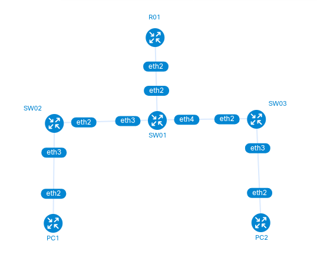
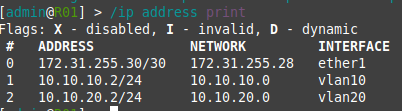
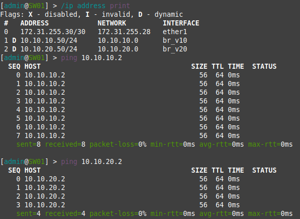
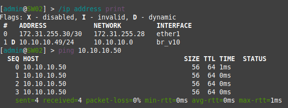
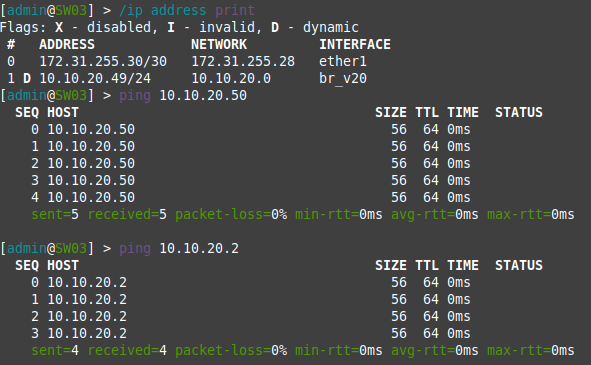
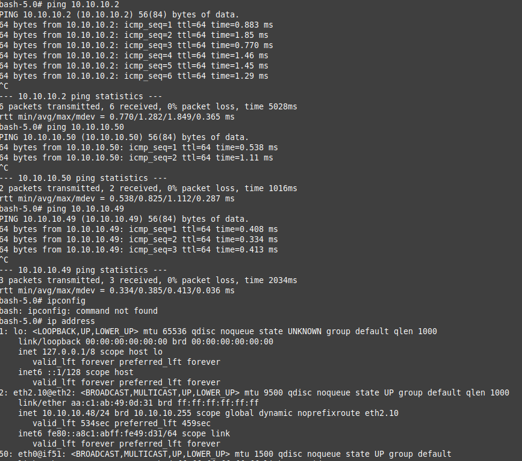
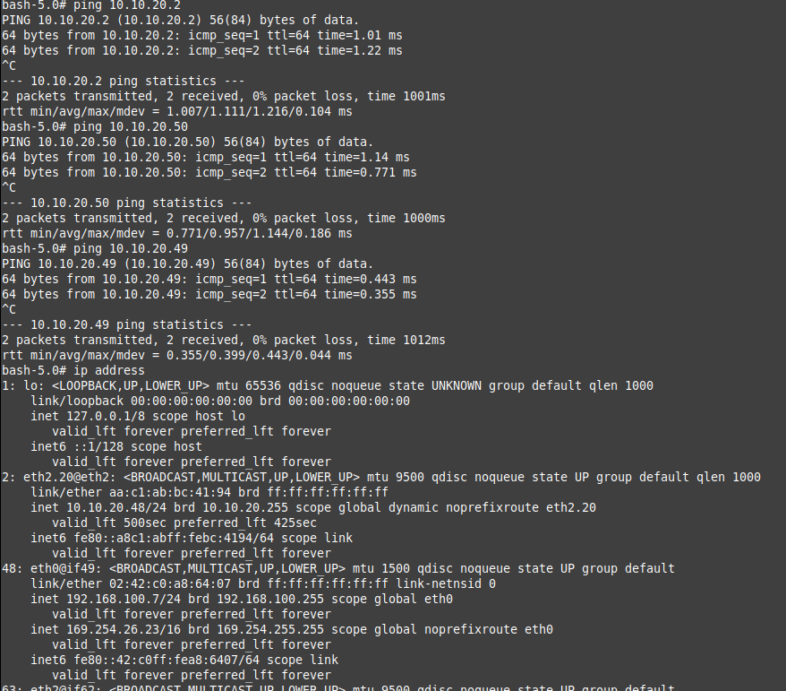

University: [ITMO University](https://itmo.ru/ru/)
Faculty: [FICT](https://fict.itmo.ru)
Course: [Introduction in routing](https://github.com/itmo-ict-faculty/introduction-in-routing)
Year: 2024/2025
Group: K3322
Author: Gorlov Andrey Borisovich
Lab: Lab1
Date of create: 17.09.2024
Date of finished: 18.09.2023

Топология сети находится в [файле](lab1.clab.yml)

Выглядит она так:

Все файлы конфигурации находятся в файлах, в [папке configs](configs/)
 
Результаты всех пингов

R01:

SW01:

SW02:

SW03:

PC1:

PC2:

