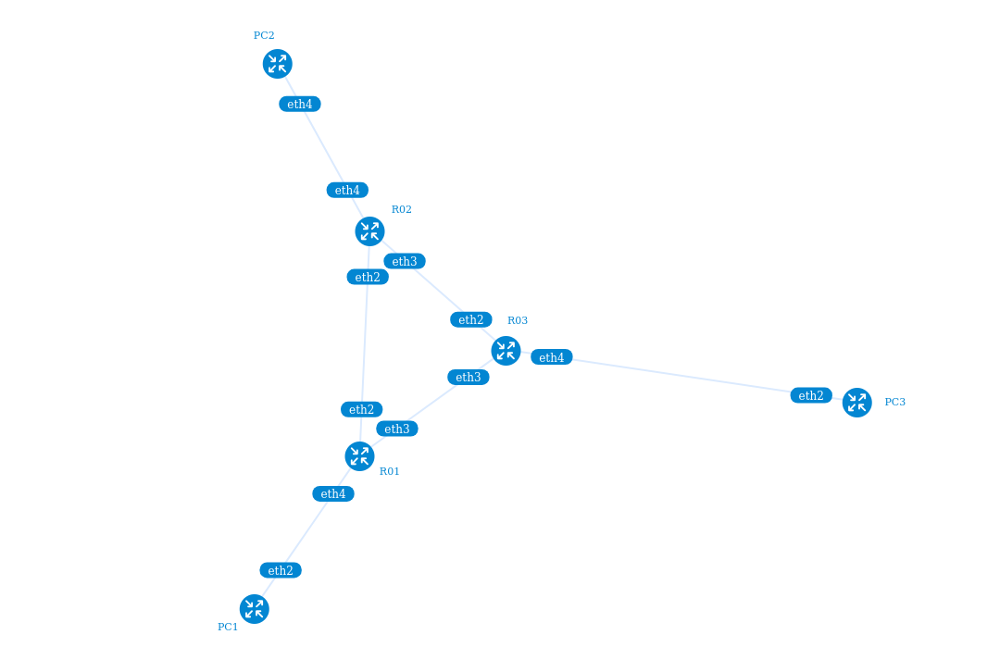
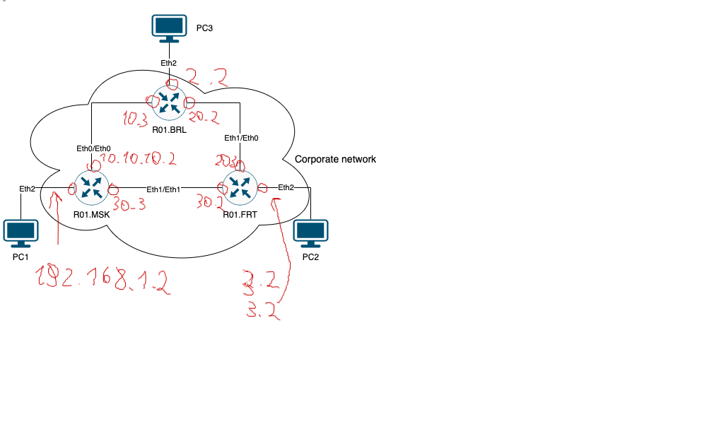
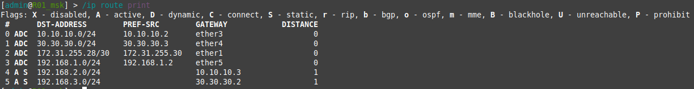
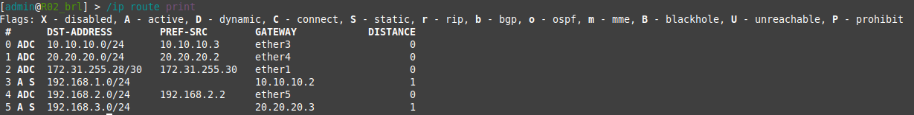
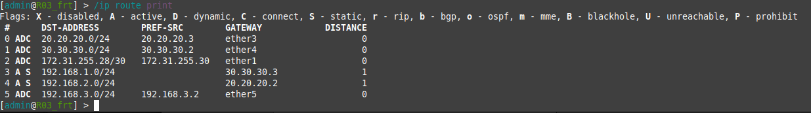
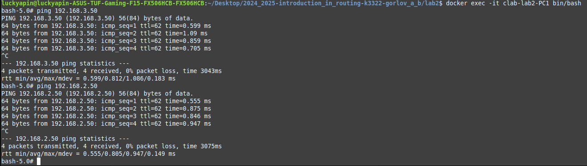
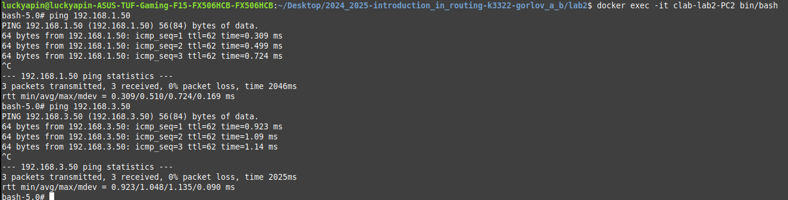
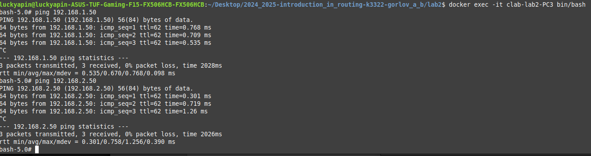

University: [ITMO University](https://itmo.ru/ru/)
Faculty: [FICT](https://fict.itmo.ru)
Course: [Introduction in routing](https://github.com/itmo-ict-faculty/introduction-in-routing)
Year: 2024/2025
Group: K3322
Author: Gorlov Andrey Borisovich
Lab: Lab2
Date of create: 24.09.2024
Date of finished: 25.09.2024

## топология

Сначала была создана топология сети, она получилась такой

## Статические адреса

Потом были расписаны адреса сетей и интерфейсов

## Настройка 

Потом были настроены роутеры и компьютеры (конфигурация в файле [configs](configs))

Таблицы маршрутизации на картинках ниже 

### R01_msk

### R02_brl

### R03_frt

## Результаты пингов

### PC1->PC2, PC3

### PC2->PC1, PC3

### PC3->PC1, PC2

