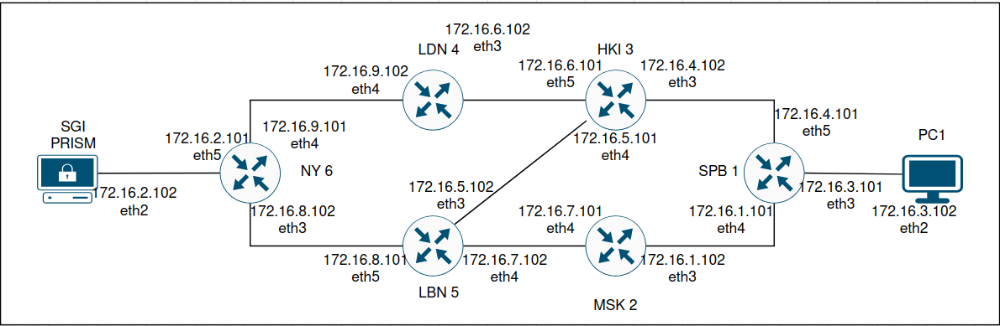
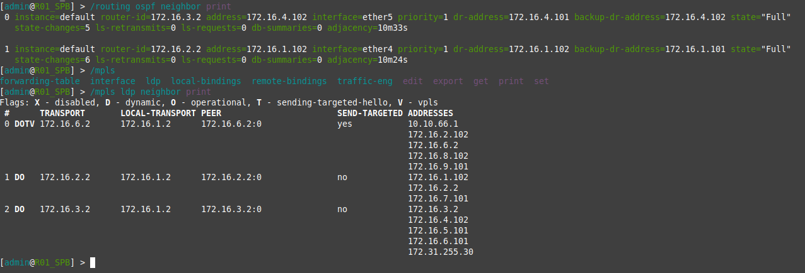
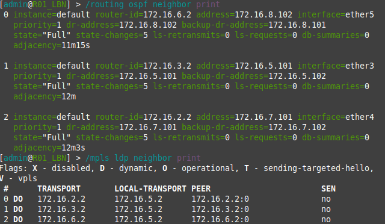
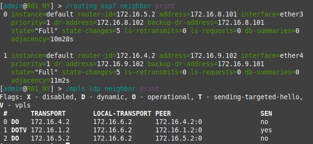
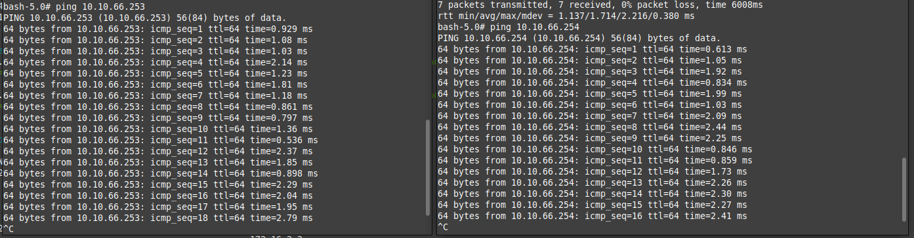

University: [ITMO University](https://itmo.ru/ru/)

Faculty: [FICT](https://fict.itmo.ru)

Course: [Introduction in routing](https://github.com/itmo-ict-faculty/introduction-in-routing)

Year: 2024/2025

Group: K3322

Author: Gorlov Andrey Borisovich

Lab: Lab2

Date of create: 14.10.2024

Date of finished: 16.10.2024

## топология

Сначала была создана топология сети и расписаны все адреса сетей и интерфейсов

## Настройка 

Потом были настроены роутеры и компьютеры (конфигурация в файле [configs](configs))

## Проверка работоспособности OSPF и MPLS
Приведены только основные 3 из 6

### SPB

### LBN

### NY

## Результаты пингов после настройки EoMPLS(VPLS)

### PC1 -> SG_PRISM и SG_PRISM -> PC1

