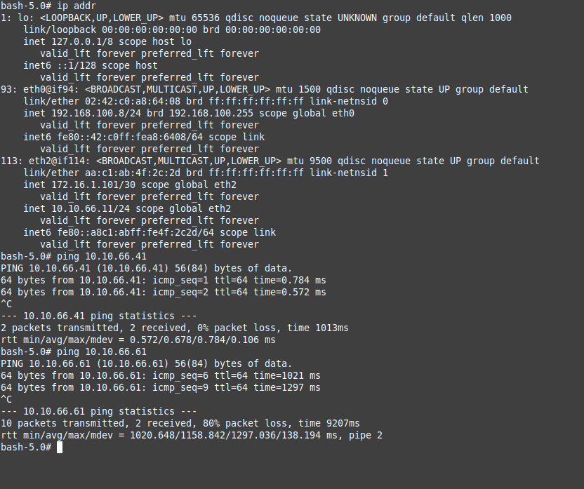

University: [ITMO University](https://itmo.ru/ru/)

Faculty: [PIN](https://fict.itmo.ru)

Course: [Introduction in routing](https://github.com/itmo-ict-faculty/introduction-in-routing)

Year: 2024/2025

Group: K3322

Author: Gorlov Andrey Borisovich

Lab: [Lab4](https://itmo-ict-faculty.github.io/introduction-in-routing/education/labs2023_2024/lab4/lab4/#_4)

Date of create: 8.12.2024

Date of finished: 11.12.2024

## топология

Сначала была создана топология сети и расписаны все адреса сетей и интерфейсов

## Часть 1 
### Настройка 

Потом были настроены роутеры и компьютеры (конфигурация в файле [configs_part1](configs_part1))

## Проверка работоспособности IBGP VRF 

### SPB

### SVL

### NY

Пинги проходят

## Часть 2
### Настройка

Отвязали VRF и настроили VPLS BGP (конфигурация в файле [configs_part2](configs_part2))

### Результаты пингов

Все всех могут пингануть
